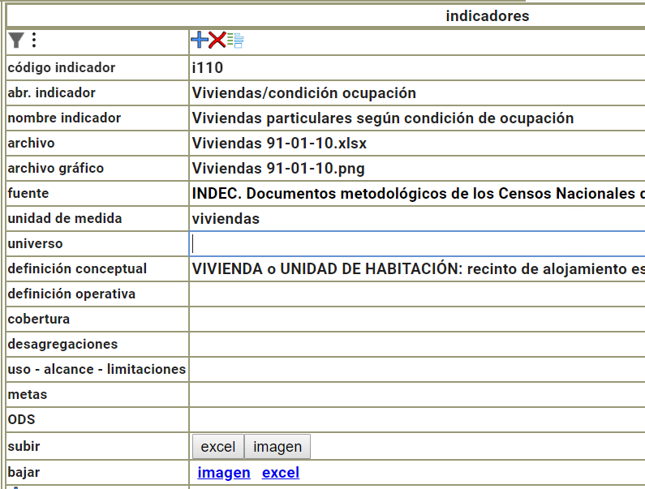

# Tareas del coordinador de contenidos

Antes de comenzar sus tareas debe ingresar al sistema, para ello debe reemplazar en la dirección de la página `/vi` por `/login`

## ingresar un nuevo indicador

En la opción de menú dimensiones se debe elegir la dimensión dentro de la cual se agregará el indicador, abriendo los indicadores (`columna I`) se puede agregar un renglón para el nuevo indicador, empezando por el código del indicador. 

## datos de la ficha del indicador

El código de indicador es lo que identifica un indicador dentro del sistema, ese código no es mostrado al visitante del sistema.

La `abreviación` es un nombre corto que aparece en la ficha al mostrar el indicador, 
la `denominación` es el nombre completo y correcto del indicador, aparece al desplegar la ficha del indicador. 

Los indicadores se muestran ordenados según la columna `orden`

Para facilitar la tarea de edición se puede usar el modo vertical 

## carga de Excel

El archivo Excel se carga desde el botón correspondiente en la ficha del indicador. **Debe ser un archivo .xlsx**

Se puede descargar el Excel desde la misma ficha.

## carga de la imágen resúmen

Para cargar la imágen debe haber cargado antes un archivo Excel (si no no permite cargar la imágen). 

Al abrir el botón de carga de imagen se espera que el coordinador pegue una imagen que debe haber copiado previamente desde el Excel con la herramienta "Recorte" de windows (o similar). 
Luego al presionar Ctrl-V se mostrará la imágen y el tamaño de la misma (si es muy grande o muy pequeña el sistema avisa).

